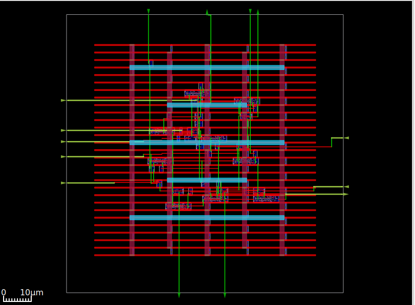
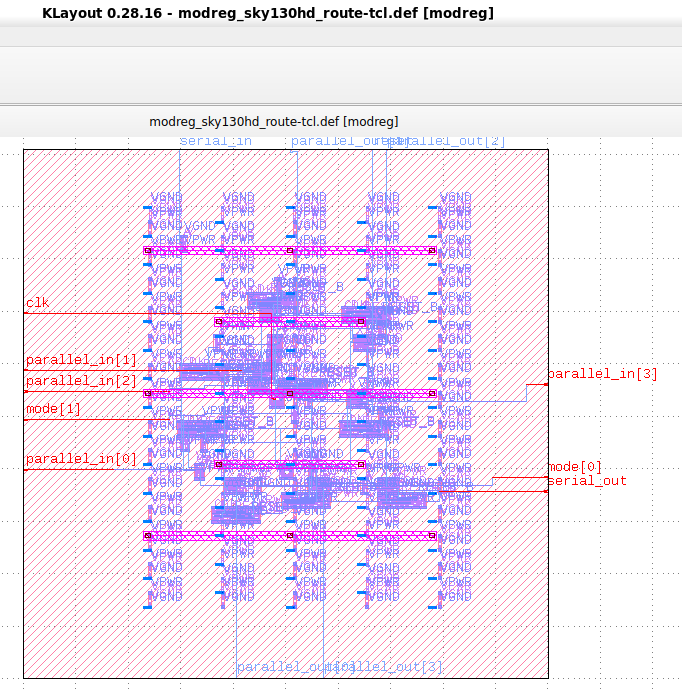

# RTL-to-GDSII flow
OpenROAD is the leading open-source, foundational application for semiconductor digital design. The OpenROAD flow delivers an Autonomous, No-Human-In-Loop (NHIL) flow, 24 hour turnaround from RTL-GDSII for rapid design exploration and physical design implementation.
### I am using Ubuntu-24.04 on WSL(Windows Subsystem for linux) and using VsCode for writing and editing Verilog codes and automation scripts, if you want to work on WSL then install WSL properly in Windows 10/11 and flow this method, then you are good to go

## For PDF's, click here, [Google Drive], (https://drive.google.com/drive/u/0/folders/1R5g80_2vsLyNkqTgExah--MmyJZfzvo_)
### For standalone Ubuntu installation this also works fine

```
  Title:
  RTL-GDSII flow Using OpenROAD
   ____________________________________________________
  |  ->Synthesis                                       |
  |      : Inputs  [RTL, SDC, .lib, .lef]              |
  |      : Logic Synthesis  (Yosys)                    |
  |      : Output files  [Netlist, SDC]                |
  |  ->Floorplan                                       |
  |      : Floorplan Initialization                    |
  |      : IO placement  (random)                      |
  |      : Timing-driven mixed-size placement          |
  |      : Macro placement                             |
  |      : Tapcell and welltie insertion               |
  |      : PDN generation                              |
  |  ->Placement                                       |
  |      : Global placement without placed IOs         |
  |      : IO placement  (optimized)                   |
  |      : Global placement with placed IOs            |
  |      : Resizing and buffering                      |
  |      : Detailed placement                          |
  |  ->CTS : Clock Tree Synthesis                      |
  |      : Timing optimization                         |
  |      : Filler cell insertion                       |
  |  ->Routing                                         |
  |      : Global Routing                              |
  |      : Detailed Routing                            |
  |  ->Finishing                                       |
  |      : Metal Fill insertion                        |
  |      : Signoff timing report                       |
  |      : Generate GDSII  (KLayout)                   |
  |      : DRC/LVS check (KLayout)                     |
  |____________________________________________________|
```

```
sudo apt-get update
sudo apt - get update
sudo apt - get install gperf
sudo apt - get install autoconf
sudo apt - get install gcc g ++
sudo apt - get install flex
sudo apt - get install bison
```
# installation of Icarus Verilog 
```
wget https://github.com/steveicarus/iverilog/archive/refs/tags/v12_0.tar.gz

tar -xvzf v12_0.tar.gz

cd iverilog-12_0
sh autoconf.sh
./configure

sudo make
sudo make install
```
test the installation: 
write 'iverilog' in terminal and press enter
successful installation should show this output:
    iverilog: no source files and would suggest -c , -y etc.

# installation of gtkwave
```
sudo apt install gtkwave
```
we will see how the signals are plotted using an example in gtkwave.

# installation of COVERED Verilog Code Coverage Analyzer
```
sudo apt update
sudo apt-get install zlib1g-dev
git clone https://git.savannah.gnu.org/git/libiconv.git

sudo apt-get install tcl8.6
sudo apt-get install tcl8.6-dev
sudo apt-get install tk8.6
sudo apt-get install tk8.6-dev
sudo apt-get install doxygen

git clone https://github.com/chiphackers/covered
cd covered
./configure
sudo make
sudo make install
```
if ‘Tcl Interp′ has no member named ‘result′ error occurred:
```
cd covered
cd src
gedit report.c
```
In the report.c file you will see a list of #include commands. Find #include <tcl.h> and
add the following command '#define USE_INTERP_RESULT 1' before #include <tcl.h>.

Your report will look like this:
```
#ifdef HAVE TCLTK
#define USE_INTERP_RESULT 1
#include <tcl.h>
```
Save the report.c file.
Run the make command again and proceed with the installation process as shown above.

# test
source verilog code:
```

// 4 bit synchronous counter
module Mycounter (CLK, RST , OUT );
 input CLK, RST;
 output [3:0] OUT ;
 reg [3:0] OUT;

 always @( posedge CLK )
 begin
 if (RST == 1'b1 )
    OUT <= 4'b0000 ;
 else
    OUT <=OUT+1;
 end
endmodule
```

Testbench verilog code:
```

// Testbench for a 4 bit synchronous counter
module Testbench ();
reg Clock , Reset ;
wire [3:0] Count ;

// instantiate the DUV and make connections
Mycounter I1(.CLK ( Clock ),. RST ( Reset ),.OUT( Count ) );

// initialize the Testbench
initial begin
$display (" Starting simulation ...");
Clock = 1'b0 ;
Reset = 1'b1 ; // reset the counter at t=0
# 100 Reset = 1'b0 ; // remove reset at t=100
# 2000 Reset = 1'b1 ; // remove reset at t= 2100
# 400 $finish ; // end the simulation after t= 2500
end

// generate stimulus (in this case clock signal )
always #50 Clock =∼Clock ;// clock period =100

// monitor the response and save it in a file

initial begin
$dumpfile ("count.vcd"); // specifies the VCD file
$dumpvars ; // dump all the variables
$monitor ("%d ,%b ,%b ,%d", $time , Clock , Reset , Count );
 end
endmodule
```
# Simulation and viewing the output waveform

• Launch the Linux distribution and make a directory
$ mkdir icarus_codes

where icarus codes is the name of the directory.

• Change directory to icarus codes. For simulation, you require a Verilog code for the
implemented functionality and a test bench in .v format. Include those in the working
directory. Let’s say my verilog code is named ```Mycounter.v``` and the Testbench is ```Testbench.v```. To simulate:
```
$ iverilog -o Mycounter Mycounter.v Testbench.v
$ vvp Mycounter
```
A dump file, which I have named as count.vcd in the test bench, is created, and you can
see the output on the terminal as well. You can also view the output in the GTKWave

```$ gtkwave count.vcd```
This command launches the GTKWave analyzer application. In the left panel, expand
the Testbench and click on the subfolder. It will expand to show input Clock, Reset and
output waveform OUT[3:0]. Drag those to the Signals panel and analyze the results.

# Generate the code coverage report
To estimate the percentage of RTL design tested by the test bench, COVERED Verilog Code
Coverage Analyzer tool is used.
• Generate the code coverage report in the same directory i.e., icarus codes by executing
the following command
```
$ covered score -t Testbench -v Testbench.v -v Mycounter.v -vcd count.vcd -o Mycounter.cdd
```
• To view the coverage report, execute
```
$ covered report -d v Mycounter.cdd
```
The coverage report is displayed in the terminal.

if encountered any error called "segmentation fault"
try this:
```
sudo apt-get install gedit
```
open the generated vcd file in gedit, find the line "$comment Show the parameter values. $end" and delete it.

save the vcd file then agin run the flow, it should work now.

# install dependencies for yosys synthesys tool
```
sudo apt-get install -y build-essential clang bison flex libreadline-dev gawk tcl-dev libffi-dev git graphviz xdot pkg-config python3 libboost-system-dev libboost-python-dev libboost-filesystem-dev zlib1g-dev
```

# install yosys
```
git clone https://github.com/YosysHQ/yosys.git
git submodule update --init
cd yosys
sudo make 
sudo make install
```
after install try invoking yosys like: ```./yosys```
The tool launches, and the command prompt changes to
```yosys>```

# Using yosys to synthsize design 

Here i have given the library file named ```Nangate45_typ.lib```

to synthesize any verilog source file using yosys this library file must be included in the tcl automation script.

make a file named ```yosys_commands.tcl``` and put this lines into the file and save.
```
#Read modules from verilog
read_verilog counter.v

#Elaborate design hierarchy
hierarchy −check −top Mycounter

#Translate Processes to netlist
proc

#mapping to the internal cell library
techmap

#mapping flip-flops to Nangate45_typ.lib
dfflibmap −liberty Nangate45_typ.lib

#mapping logic to Nangate45_typ.lib
abc -liberty Nangate45_typ.lib

#remove unused cells
clean

#write the synthesized design in a verilog file
write_verilog −noattr synth_Mycounter.v
``` 
This TCL script should be run, after yosys is invoked. This will automate the synthesize process and write the synthesized netlist from the source verilog file

# Steps to perform the logic synthesis & optimization
Launch the yosys tool
```$ yosys```
I am using a yosys_commands.tcl file.
```yosys> script yosys_commands.tcl```

similarly run the given ```not_opt.tcl``` and ```opt.tcl``` scripts for viewing the non-optimized block diagram and optimized block diagrams respectively in graphviz(xdot) window
 
# installation OpenSTA tool for timing and power analysis
```
sudo apt-get update
sudo apt-get install build-essential tcl-dev tk-dev cmake git

git clone https://github.com/The-OpenROAD-Project/OpenSTA.git
cd OpenSTA
mkdir build
cd build
cmake ..
```
If error comes like ```Cmake error at CMakelists.txt``` then move to home directory using "cd" command and install
 ```
 sudo apt-get install libeigen3-dev
 ```
again move to the build directory in OpenSTA and Configure the build by executing the
following command:
```
cmake ..
```
If again any CMake error then again move to home directory and install cudd.
```
git clone https://github.com/ivmai/cudd.git
sudo apt-get install automake
sudo apt-get install autoconf m4 perl

cd cudd
autoreconf -i
mkdir build
cd build
../configure --prefix=$HOME/cudd
sudo make
sudo make install

```
Now cudd is installed successfully.
Now move to opensta directory
```
cd OpenSTA
cd build
cmake .. -DUSE_CUDD=ON -DCUDD_DIR=$HOME/cudd
sudo make
sudo make install 
```

Now invoke opensta from the terminal by simply type "sta" and press enter it changed the prompt to 
```
sta [~/working_directory]

or, 
it will be shown like 

%
```

# using opensta for timing and power analysis
after successful installation of opensta run the ```time.tcl``` to analyse the timing of inputs and outputs, After that run ```power.tcl``` to analyse the power dissipation by the designed circuit.

For time analysis using opensta
```
% source time.tcl
```
For power analysis using opensta
```
% source power.tcl
```


# installation of OpenROAD tool for Generation of final GDS 
Download OpenROAD repository
```
git clone --recursive https://github.com/The-OpenROAD-Project/OpenROAD.git
cd OpenROAD
```
Install Dependencies
```
sudo ./etc/DependencyInstaller.sh
```
Build OpenROAD
```
mkdir build
cd build
cmake ..
sudo make
sudo make install
```
If after running "cmake" it shows error like: ``` CMake Error: Could not find CMAKE_ROOT !!! ```
then run ``` export CMAKE_ROOT=/usr/local/share/cmake-3.16 ``` and run ``` echo $CMAKE_ROOT ```, it should reflect the path, then rerun "cmake" and agin run "make & make install" 

If still any errors are occurred:
```
sudo apt install swig
sudo apt update
```

Invoke OpenROAD tool from the terminal and it should be changed to ``` openroad> ```

# Using OpenROAD Tool
Script used to execute activity:
```
design_nangate45.tcl
```
# Inputs to the OpenRoad Tool
```
1. RTL Netlist: gcd_nangate45.v
(Location: OpenROAD/test/gcd_nangate45.v)
2. SDC file: gcd_nangate45.sdc
(Location: OpenROAD/test/gcd_nangate45.sdc)
3. Library file: Nangate45_typ.lib
(Location: OpenROAD/test/Nangate45/Nangate45_typ.lib)
4. LEF file
A. Technology Lef: Nangate45_tech.lef
(Location: OpenROAD/test/Nangate45/Nangate45_tech.lef)
B. Standard Cell Lef: Nangate45_stdcell.lef
(Location: OpenROAD/test/Nangate45/Nangate45_stdcell.lef)
```

write ```design_nangate45.tcl``` file 
```
source "helpers.tcl"
source "flow_helpers.tcl"
source "Nangate45/Nangate45.vars"
set design "<design name>"
set top_module "<design main module>"
set synth_verilog "synth_design.v"
set sdc_file "top.sdc"
set die_area {0 0 100.13 100.8}
set core_area {10.07 11.2 90.25 91}
source -echo "flow.tcl”
```

Now all files are ready, some specific files need to copy into "OpenROAD/test" folder, this are:
```
design.v
synth_design.v
top.sdc
design_nangate45.tcl
```
after copying this files into ``` OpenROAD/test``` folder, go to the same directory & invoke openroad
for copying files from one directory to another directory is:
```
sudo cp -i /path/of/your/directory/<filename> /path/to/directory/to/copy/
```
then
```
openroad> sudo openroad -gui -log design_logfile.log design_nangate45.tcl 
```

Running this command it will generate ASIC layout which will be visible in openroad gui
Now to save it as GDSII it need klayout.

# installation of klayout
```
sudo apt install klayout
```
Open klayout using this command
```
klayout &
```

Now click on the file button and choose reader option
then  click on "LEF/DEF" tab, there "Nangate45.lef" file need to be put and uncheck the checkbox(if checked) or remain same
location of "Nangate45.lef" is
```
/OpenROAD/test/Nangate45/Nangate45.lef
```
then click ok.
After that click again on file and choose open, now a dialogue box will open, navigate to
```
/OpenROAD/test/result
```
There ```design.def``` file will be located, click on the def file and click on ok.
Now It will open in GDSII mode and can be saved as GDSII.

Now Design is ready to sent to foundry for fabrication.

### GDSII of Multimode Select Register in OpenROAD in 130nm Technology node

### GDSII of Multimode Select Register in klayout in 130nm Technology node



# Reference 
```
[1] Installation steps for The ICARUS Verilog Compilation System. [Online]. Available:
https://github.com/steveicarus/iverilog

[2] Installation steps for Covered - Verilog Code Coverage Analyzer. [Online]. Available:
https://github.com/chiphackers/covered/blob/master/INSTALL

[3] S. Saurabh, Introduction to VLSI Design Flow. Cambridge: Cambridge University Press,
2023.

[4] Installation steps for Yosys Open SYnthesis Suite. [Online]. Available: https:
//github.com/YosysHQ/yosys

[5] S. Saurabh, Introduction to VLSI Design Flow. Cambridge: Cambridge University Press,
2023.

[6] Yosys: Example Usage. [Online]. Available: https://yosyshq.net/yosys/

[7] Documentation for Yosys Open SYnthesis Suite commands. [Online]. Available:
https://yosyshq.readthedocs.io/projects/yosys/en/manual-rewrite/cmd ref.html

[8] Ajayi, Tutu, Vidya A. Chhabria, Mateus Fogaça, Soheil Hashemi, Abdelrahman Hosny,
Andrew B. Kahng, Minsoo Kim et al. "Toward an open-source digital flow: First learnings
from the openroad project." In Proceedings of the 56th Annual Design Automation
Conference 2019, pp. 1-4. 2019.

[9] Ajayi, Tutu, and David Blaauw. "OpenROAD: Toward a self-driving, open-source digital
layout implementation tool chain." In Proceedings of Government Microcircuit
Applications and Critical Technology Conference. 2019.

